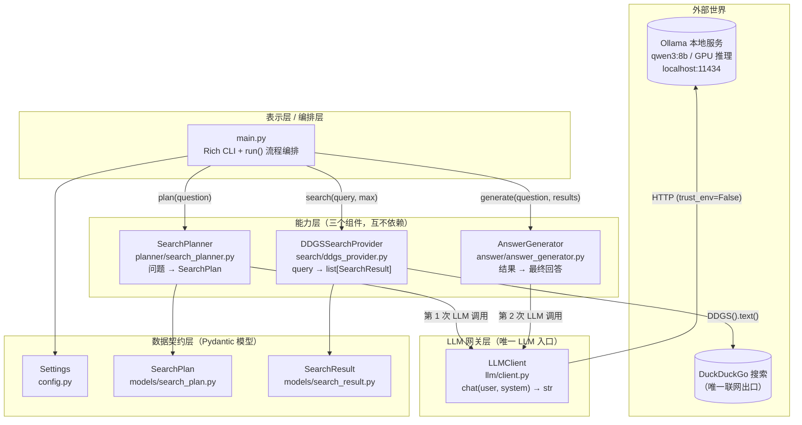
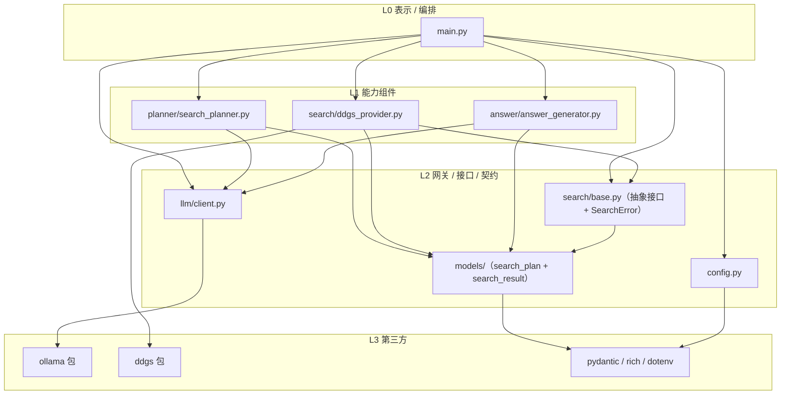
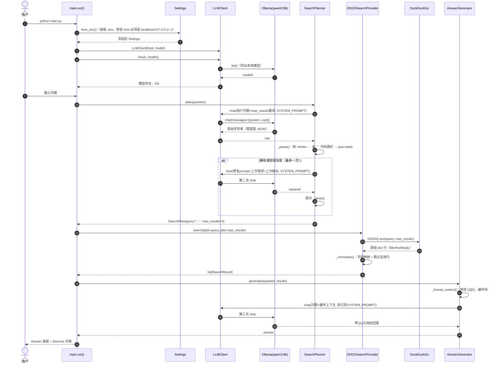
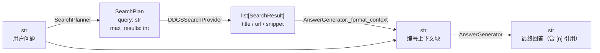
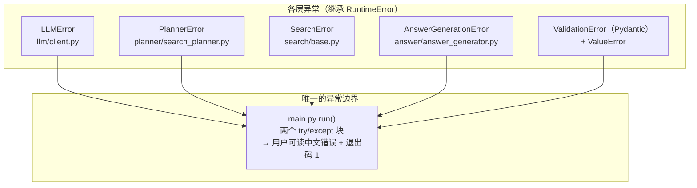
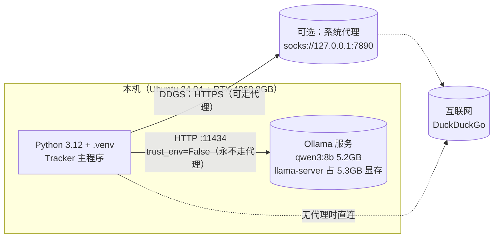

# Tracker V0.1 超级架构解析

> 面向 Agent 开发学习者的逐层拆解。所有 Mermaid 图在 VSCode Markdown 预览（Ctrl/Cmd+Shift+V）中原生渲染。

## 0. 一句话心智模型

Tracker 是一个**「LLM 调用 → 工具执行 → LLM 再调用」的最简 Agent 骨架**：

1. 本地 LLM（Ollama/qwen3:8b）把自然语言问题**规划**成一个结构化动作（`SearchPlan`）
2. 一个**工具**（DDGS 搜索引擎）执行该动作，拿到真实世界数据
3. 工具结果**注回上下文**，再次调用 LLM 生成带引用的最终回答

它不是完整的 Agent（没有循环、没有多工具、没有记忆），但它把 Agent 开发中最核心的五个模式都实现了（见 §7）。

---

## 1. 全景分层图

**关键设计：依赖方向永远向下。** `main.py` 是唯一知道所有组件存在的地方；Planner / Answer 只知道 `LLMClient`；Provider 只知道 DDGS 和自己的模型。任何层都不反向 import 上层。

---

## 2. Import 依赖图（模块间的真实耦合）

要点：

- **`llm/client.py` 不 import 任何项目模块**——它是纯网关，换模型/换部署方式（如以后换云端或换 vLLM）只动这一个文件。
- **Planner、Provider、Answer 三者零耦合**——各自只依赖 L2 的契约，所以可以独立测试、独立替换。
- **DDGS 库只在 `ddgs_provider.py` 出现一次**——外部世界的脏细节被适配器隔离。

---

## 3. 一次完整问答的运行时序列

注意三个 LLM 调用点的区别：

| # | 调用方 | 用途 | 输出约束 |
|---|--------|------|----------|
| 1 | SearchPlanner | 把问题变成搜索动作 | JSON，Pydantic 校验，失败可重试 1 次 |
| 2 | SearchPlanner（重试） | 修复上次坏输出 | 同上 |
| 3 | AnswerGenerator | 基于工具结果生成回答 | 自由文本 + [n] 引用 |

---

## 4. 对象管道（数据如何一步步变形）

项目的「血液」只有一种：**str 进出 LLM，结构化对象在组件之间传递**。LLM 的不可靠输出在进入管道前就被 Pydantic 收敛成可靠对象。

---

## 5. 逐模块解剖

### 5.1 表示/编排层 — [main.py](main.py)

- [main.py:21-31](main.py#L21-L31)：启动三段式——打印 Banner → 加载配置 → 构造 `LLMClient` 并做健康检查。**失败立即退出码 1**，绝不带着坏状态往下跑。
- [main.py:38-40](main.py#L38-L40)：**手动依赖注入**。`planner`、`provider`、`answer_generator` 都在这里组装，`LLMClient` 实例被 Planner 和 Answer 共享（同一个模型服务）。
- [main.py:42-58](main.py#L42-L58)：核心编排只做一件事：**按顺序调用三个组件，用 `console.status` 给用户实时反馈**。没有条件分支、没有循环——这是「管道式编排」。
- [main.py:60-65](main.py#L60-L65)：`rich.Panel` 展示回答，来源列表带可点击链接（`[link=...]`）。

### 5.2 配置层 — [config.py](src/config.py)

- [config.py:12-19](src/config.py#L12-L19)：`Settings` 是 `frozen=True` 的 Pydantic 模型——**配置不可变，构造后无法被误改**。
- [config.py:21-32](src/config.py#L21-L32)：`field_validator` 强制 `OLLAMA_HOST` 只能是 `localhost`/`127.0.0.1`/`::1`。这是项目的**安全护栏**：结构上保证「永远不用云端 LLM」，而不是靠约定。
- [config.py:42-49](src/config.py#L42-L49)：`from_env()` 用 `load_dotenv()` 读 `.env`，每个键有默认值。

**Agent 开发启示**：把「不可违反的约束」写进校验器而不是写进文档。LLM 输出同理——见 5.4。

### 5.3 数据契约层 — [models/](src/models/)

两个模型定义了组件之间的「接口语言」：

- [search_plan.py:6-16](src/models/search_plan.py#L6-L16)：`SearchPlan`，`extra="forbid"`（LLM 多给字段直接拒绝），`query` 经过 strip 规范化。
- [search_result.py:6-17](src/models/search_result.py#L6-L17)：`SearchResult`，`url` 用 `AnyHttpUrl`（无效 URL 在构造时即被拒，见 §5.6 的跳过逻辑），标题/摘要非空。

`extra="forbid"` 是刻意选择：对 LLM 输出**宁严勿宽**，坏结构越早爆炸越容易定位。

### 5.4 LLM 网关 — [llm/client.py](src/llm/client.py)

项目的「LLM 唯一入口」。全项目只有这里 import `ollama` 包。

- [client.py:10-29](src/llm/client.py#L10-L29)：**代理导入隔离 hack**。`ollama` 包在 import 时创建模块级默认 client 并读取代理变量，而 HTTPX 会拒绝 `socks://127.0.0.1:7890` 这类值。解决：import 前临时 `os.environ.pop` 六个代理键，`finally` 中恢复——DDGS 仍能正常用系统代理，本地请求绝不走代理。
- [client.py:39-50](src/llm/client.py#L39-L50)：构造时**二次校验** host 是本机（和 config 的双保险），`trust_env=False` 保证运行时请求也不读代理。
- [client.py:52-66](src/llm/client.py#L52-L66)：`check_health()` 做两件事：服务可达 + 模型已下载（`qwen3:8b` 和 `qwen3:8b:latest` 视为同一个，见 [client.py:121-123](src/llm/client.py#L121-L123)）。
- [client.py:68-87](src/llm/client.py#L68-L87)：`chat(user_prompt, system_prompt) → str` 是全项目的**最小 LLM 原语**。无状态：每次调用重新组装 messages，不保留对话历史。
- [client.py:89-102](src/llm/client.py#L89-L102)：`_extract_content` 兼容 ollama 对象和 dict 两种响应形态（防御性解析，方便 mock）。

**Agent 开发启示**：把 LLM 封装成一个**纯函数**（字符串进、字符串出、抛统一异常），上层组件完全不知道模型是本地还是云端、是 OpenAI 还是 Ollama。这是未来换模型零成本的前提。

### 5.5 规划器 — [planner/search_planner.py](src/planner/search_planner.py)

全项目**最「Agent」的模块**，值得逐行学习：

- [search_planner.py:19-23](src/planner/search_planner.py#L19-L23)：SYSTEM_PROMPT 就是**手工版 JSON Schema 约束**：只输出一个 JSON 对象、不给思考过程、明确字段类型和取值范围。没有用 OpenAI 的 function calling，但思想完全一致。
- [search_planner.py:33-62](src/planner/search_planner.py#L33-L62)：`plan()` 的**修复重试模式**（self-correction 的最简版）：
  1. 第一次调用 → 解析/校验失败
  2. 把**上次的原始输出原文**塞回修复 prompt（[search_planner.py:46-51](src/planner/search_planner.py#L46-L51)）——让模型看到自己错在哪
  3. 第二次再失败 → 抛 `PlannerError`，**不无限重试**
- [search_planner.py:64-74](src/planner/search_planner.py#L64-L74)：`_parse()` 三段式清洗，对付 Qwen 的常见坏习惯：
  - 正则剥掉 `<think>...</think>`（Qwen3 的思维链输出）
  - 剥掉 Markdown code fence
  - `json.loads`，失败则走兜底
- [search_planner.py:76-87](src/planner/search_planner.py#L76-L87)：`_extract_json_object()` **扫描式兜底**：从每个 `{` 起用 `raw_decode` 试解析，取第一个成功者。模型在 JSON 前后唠叨废话也能救回来。

**Agent 开发启示**：这是「LLM 输出不可靠 → 校验 → 把失败反馈给模型重试」闭环的最小实现。真实 Agent 框架（function calling + 校验循环）只是把这一套做得更通用。

### 5.6 搜索层 — [search/](src/search/)

- [base.py:12-16](src/search/base.py#L12-L16)：`SearchProvider` 抽象基类，只有一个抽象方法。**这是项目里「工具注册表」的雏形**：Agent 框架里的 tool 就是这样的接口。目前只有一个实现，但加 Google/Bing 只需新增一个类。
- [ddgs_provider.py:20-21](src/search/ddgs_provider.py#L20-L21)：构造函数接受可选的 `search_func`——**依赖注入到函数粒度**，测试时传 lambda 即可完全离线（见 §6）。
- [ddgs_provider.py:23-42](src/search/ddgs_provider.py#L23-L42)：`search()` 做了参数防御（空查询、越界 max_results）+ 统一异常翻译。
- [ddgs_provider.py:44-64](src/search/ddgs_provider.py#L44-L64)：`_normalize()` 是**适配器模式**核心：
  - DDGS 字段名（`href`/`body`）映射为项目统一字段（`url`/`snippet`），同时兼容 `url`/`snippet` 别名
  - 每行独立 try/except，**坏行跳过而不是整体失败**（外部数据脏是常态）
  - 达到 max_results 提前 break

### 5.7 回答生成 — [answer/answer_generator.py](src/answer/answer_generator.py)

- [answer_generator.py:11-15](src/answer/answer_generator.py#L11-L15)：SYSTEM_PROMPT 是**反幻觉护栏**：「只依据搜索结果、不足则明说、用 [n] 标注来源、语言跟随用户」。这是 RAG 类系统提示词的教科书模板。
- [answer_generator.py:35-45](src/answer/answer_generator.py#L35-L45)：`_format_context()` 把每条结果编号成 `[1] Title/URL/Snippet` 块——**这就是「工具结果注入上下文」的原始形态**。Agent 框架里的 observation/tool_result 回填，做的就是这个。
- [answer_generator.py:24-33](src/answer/answer_generator.py#L24-L33)：`generate()` 是纯文本拼接：问题 + 编号上下文 + 指令。**没有用消息数组的多轮结构**，而是一次性把全部上下文塞进一个 user prompt。

---

## 6. 错误处理架构

每层定义自己的异常类型，**只在边界（main.py）翻译成用户语言**：

规则：

- **下层只抛自己层的异常**，把第三方异常（`ConnectionError`、`OSError`…）用 `from exc` 包装成带操作指引的中文错误（如「请执行 `ollama pull qwen3:8b`」）。
- **重抛时保留原异常链**：`except LLMError: raise`（见 [search_planner.py:55-62](src/planner/search_planner.py#L55-L62)）——自己层的异常不重新包装。
- 所有错误**快速失败**：不吞错、不降级、不悄悄换云端模型（README 明确承诺）。

---

## 7. 测试架构

31 个测试全部**离线**——不碰 Ollama、不碰 DDGS、不碰网络：

| 测试文件 | 替身手段 | 验证重点 |
|----------|----------|----------|
| [test_llm_client.py](tests/test_llm_client.py) | `FakeOllama`（鸭子类型，测试里直接替换 `client._client`） | 本机地址拒绝、代理导入隔离（**用真实子进程**验证）、健康检查、消息组装、异常翻译 |
| [test_search_plan.py](tests/test_search_plan.py) | `StubLLM`（可编程的 `chat` 迭代器，记录调用次数） | think/围栏清洗、JSON 兜底提取、**恰好一次**重试、空问题零 LLM 调用 |
| [test_search_provider.py](tests/test_search_provider.py) | `fake_search` 函数注入 | 字段归一化、坏行跳过、参数防御、网络异常包装 |
| [test_answer_generator.py](tests/test_answer_generator.py) | `CapturingLLM`（捕获 prompt 内容） | 编号上下文格式、反幻觉指令存在、空结果拒绝 |
| [test_config.py](tests/test_config.py) | 直接构造 | 本地地址校验、边界值 |

**Agent 开发启示**：组件只依赖鸭子类型接口（`chat(str, str) -> str`、`search(str, int) -> list`），而不是具体类——所以 LLM 可以被 `StubLLM` 顶替。**当你把「模型调用」和「模型」解耦时，测试和替换都变免费。** [test_llm_client.py:48-72](tests/test_llm_client.py#L48-L72) 甚至用子进程验证了「import 时代理被隔离、import 后环境被恢复」这个最脆的 hack。

---

## 8. Agent 开发视角：已有什么、缺什么

### 8.1 标准 Agent = 四个要素，本项目对号入座

| Agent 要素 | Tracker 现状 | 位置 |
|-----------|-------------|------|
| **模型（Brain）** | 本地 qwen3:8b，经 `LLMClient` 纯函数封装 | [llm/client.py](src/llm/client.py) |
| **工具（Tools）** | 1 个：DDGS 搜索，经 `SearchProvider` 抽象 | [search/base.py](src/search/base.py) |
| **结构化动作（Action）** | LLM 输出 JSON → Pydantic 校验 → `SearchPlan` | [planner/search_planner.py](src/planner/search_planner.py) |
| **上下文回填（Observation）** | 搜索结果编号后拼回 prompt | [answer/answer_generator.py](src/answer/answer_generator.py) |

**缺的是第五要素：循环（Loop）。** 所以它是「单步 Agent」（one-shot agent），不是多步 Agent。

### 8.2 五个已经实现的 Agent 关键模式（举一反三用）

1. **工具抽象 = Agent 框架的 tool registry 雏形**：`SearchProvider` 接口只有一个 `search()`。真框架里每个 tool 就是「名字 + 描述 + JSON Schema + 执行函数」，这里的 SYSTEM_PROMPT 扮演了名字和 Schema 的角色。
2. **结构化输出 + 校验 + 反馈重试 = self-correction 最小闭环**：失败输出原文回传模型（[search_planner.py:46-51](src/planner/search_planner.py#L46-L51)）。LangChain 的 `OutputFixingParser` 干的就是这件事，这里 20 行手写版。
3. **工具结果注入上下文 = RAG/observation 回填**：`[1] Title/URL/Snippet` 编号块（[answer_generator.py:36-45](src/answer/answer_generator.py#L36-L45)）就是最原始的 context 注入。
4. **适配器隔离外部世界**：DDGS 的脏字段（`href`/`body`）被归一化成 `SearchResult`，坏行跳过。换搜索引擎、换 API 版本只动一个文件。
5. **LLM 网关单点化**：全项目只有一个 import `ollama` 的文件。模型、部署方式、代理处理全部藏在一扇门后面。

### 8.3 缺什么（升级成真 Agent 的路线）

| 缺失 | 现状 | 升级方向（V0.2+） |
|------|------|-------------------|
| **循环/多步推理** | 固定管道：plan → search → answer，LLM 不能决定「再搜一次」 | ReAct 循环：LLM 输出「动作」，执行后结果回填，直到 LLM 说「回答」 |
| **多工具** | 1 个工具，硬编码在 main.py | 工具注册表 + tool schema 注入 system prompt（或 function calling） |
| **网页正文抓取** | 只用摘要，README 明确这是 V0.1 边界 | 加 `Crawler` 工具：`SearchResult.url → fetch → 正文`，塞进上下文 |
| **记忆/历史** | `chat()` 无状态，每次调用全新 messages | `LLMClient` 支持 messages 历史，或引入对话状态对象 |
| **反思（Reflection）** | 回答一次性生成，无质量检查 | 加「critic」步骤：回答是否充分？不足则触发下一轮搜索 |
| **流式输出** | `chat()` 等完整响应 | Ollama 的 `stream=True`，网关层加 `chat_stream()` |

最小改动路径：把 main.py 的管道改成一个 `while` 循环——每轮让 LLM 从「搜索 / 回答」里选一个动作，搜索结果追加进上下文，直到 LLM 选择回答。V0.1 的三个组件一个都不用删，只是从「按固定顺序调用」变成「按 LLM 决策调用」。

---

## 9. 部署拓扑

一个容易踩的坑（开发日志里真实发生过）：同一台机器同时存在「本地 LLM」和「代理」两个网络世界，**本地请求必须绕过代理，联网搜索可以用代理**。V0.1 的做法是把代理隔离做在 `ollama` 包 import 那一刻（[client.py:14-29](src/llm/client.py#L14-L29)），而不是全局关代理。
